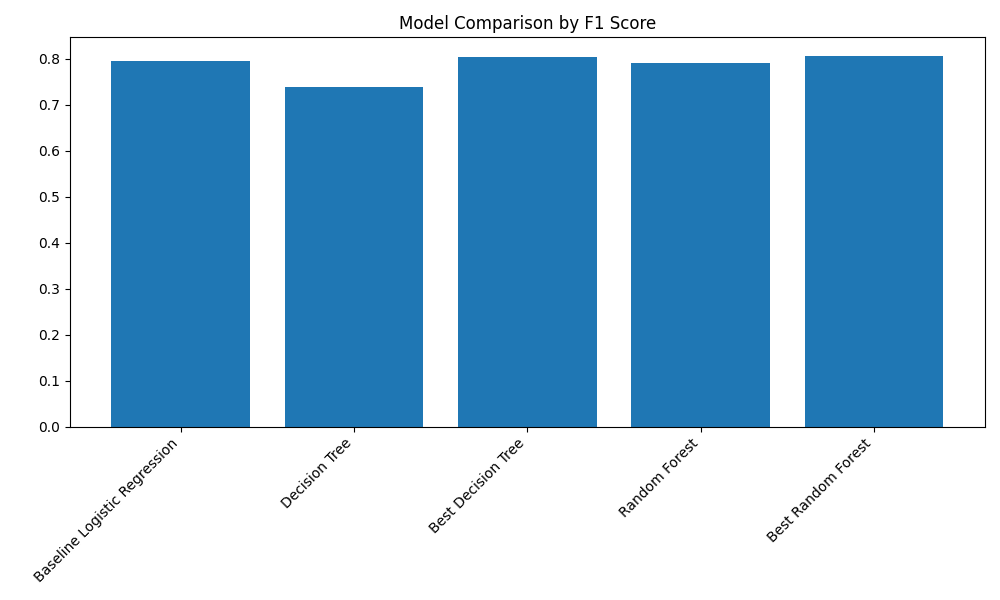

# Final ML Project — Spaceship Titanic Classification

A supervised machine learning project built on the Kaggle "Spaceship Titanic" dataset, predicting whether a passenger was transported to an alternate dimension during the spaceship's collision with a spacetime anomaly. The project walks through the full ML pipeline: exploratory data analysis, feature engineering, baseline modeling, hyperparameter tuning, and final model evaluation.

## Project Structure
├── data/ # Raw data, processed arrays, model artifacts, and metrics
├── notebooks/ # Step-by-step Jupyter notebooks (see below)
└── report_images/ # Exported plots used in the write-up / report

## Notebooks

| Notebook | Description |
|---|---|
| `01_data_understanding.ipynb` | Initial data load, structure review, missing value analysis, and exploratory visualizations (numerical & categorical distributions, correlation heatmap) |
| `02_preprocessing.ipynb` | Feature engineering (cabin parsing, group size, total spending), preprocessing pipeline, and train/validation split |
| `03_baseline_model.ipynb` | Trains and evaluates a baseline model with a confusion matrix and summary metrics |
| `04_model_tuning.ipynb` | Compares a tuned Decision Tree (grid search) and Random Forest (randomized search) to select the best-performing model |
| `05_final_model.ipynb` | Retrains the best model on the combined train + validation data, runs cross-validation, and produces final evaluation visualizations |
| `Demo.ipynb` | Quick demo notebook |

## Approach

- **EDA:** Explored distributions of `HomePlanet`, `CryoSleep`, `Destination`, `VIP`, and spending-related features, along with a missing-value and correlation analysis.
- **Feature Engineering:** Parsed the `Cabin` field into components, engineered passenger group size, and aggregated total spending across amenities.
- **Modeling:** Built a preprocessing pipeline (imputation, scaling, one-hot encoding) with `scikit-learn`, then compared a Logistic Regression baseline against tuned Decision Tree and Random Forest classifiers.
- **Evaluation:** Assessed models using accuracy, precision, recall, and F1 score, with confusion matrices and feature importance plots for interpretability.

## Results

| Stage | Accuracy | Precision | Recall | F1 |
|---|---|---|---|---|
| Baseline | 0.792 | 0.788 | 0.803 | 0.795 |
| Best Model (tuned) | 0.806 | 0.811 | 0.800 | 0.806 |
| Final Model (cross-validated) | 0.799 | 0.804 | 0.796 | 0.800 |
| Final Model (validation set) | 0.885 | 0.881 | 0.893 | 0.887 |

## Visualizations

Key plots generated during the analysis (found in `report_images/`):

- `missing_values.png` — missing data overview
- `numeric_hists.png` — distributions of numeric features
- `HomePlanet_dist.png`, `Destination_dist.png`, `VIP_dist.png`, `CryoSleep_dist.png`, `transported_dist.png` — categorical feature distributions
- `total_spend.png` — engineered total spending feature
- `correlation.png` — feature correlation heatmap
- `baseline_confusion_matrix.png` — baseline model confusion matrix
- `model_comparison_f1.png` — F1 comparison across tuned models
- `best_model_confusion_matrix.png` — confusion matrix for the selected best model
- `rf_feature_importance_top20.png` — top 20 feature importances (Random Forest)
- `final_confusion_matrix.png` — confusion matrix for the final retrained model

Example:

## Tech Stack

- Python, pandas, NumPy
- scikit-learn (pipelines, `ColumnTransformer`, `RandomForestClassifier`, `DecisionTreeClassifier`, `LogisticRegression`, `GridSearchCV`, `RandomizedSearchCV`)
- matplotlib, seaborn (visualizations)
- joblib (model persistence)
- Jupyter / Google Colab

## Getting Started

1. Clone the repo and open the notebooks in order (`01` → `05`) in Jupyter or Google Colab.
2. Ensure the `data/` folder is available relative to the notebooks (raw CSVs are already included).
3. Run each notebook sequentially — preprocessed data and trained model artifacts are saved to `data/` for use by later notebooks.

## Contributors
- Benny Hoang
- Aidan Waaler
